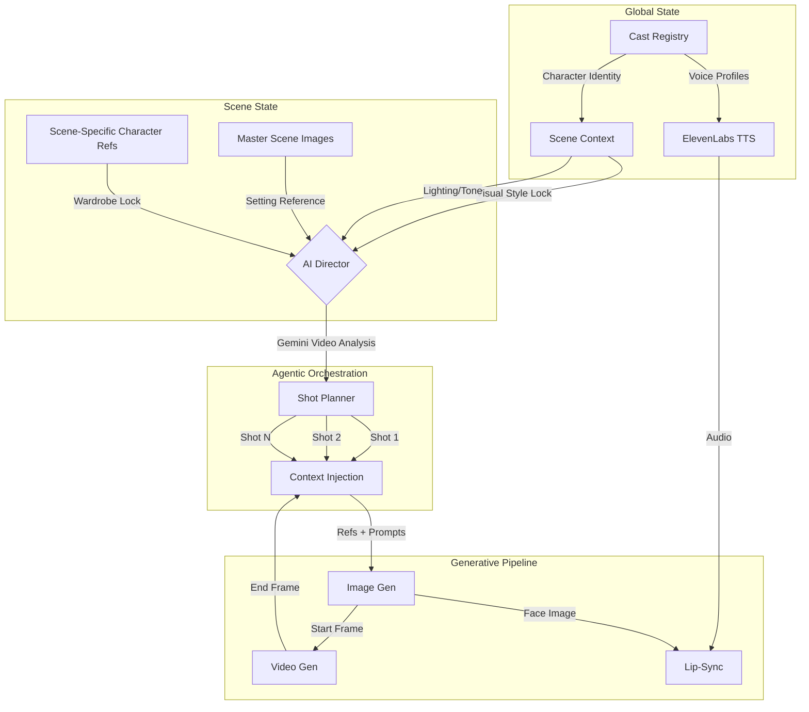
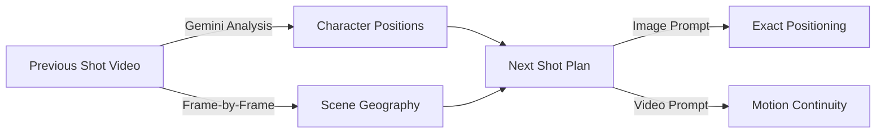

# OpenFilm AI

<div align="center">

### Agentic Shot Orchestration for AI Filmmaking

*A state-management engine for video generation that treats film production as a graph of inherited context, not a single prompt.*

<!-- TODO: Add hero GIF showing context inheritance in action -->
<!--  -->

[](https://www.python.org/downloads/)
[](https://reactjs.org/)
[](https://www.electronjs.org/)

</div>

---

## The Architectural Divergence

The current generative video industry (Google Veo, OpenAI Sora, Runway) is optimizing for **Temporal Coherence via Long Context Tuning (LCT)**. Their goal: expand the model's context window to generate 60+ seconds of continuous video in a single inference pass.

### The Problems with LCT

| Issue | Description |
|-------|-------------|
| **Latent Drift** | As the context window expands, character identity features degrade ("melting faces"). The latent representation loses fidelity over time. |
| **Editorial Rigidity** | A 60-second generation cannot be easily edited or paced without regenerating the entire context. |
| **Compute Inefficiency** | Generating a 2-minute scene as a single context window requires exponentially more compute than generating twenty 6-second clips. |

### The OpenFilm Solution: Hierarchical State Injection

Instead of Long Context Tuning, we utilize a fundamentally different architecture:

| LCT Approach | OpenFilm Approach |
|--------------|-------------------|
| Expand context window | Inject state per-shot |
| Fight latent drift | Eliminate it structurally |
| Generate entire scenes | Generate optimal 4-8s clips |
| Pixels remember pixels | State objects remember state |

**How it works:**

1. **State Management** — The "Scene" is a state object holding immutable variables (lighting, character appearance refs, visual style tokens)
2. **Short-Shot Inference** — Generate standard 4-8s clips where diffusion models perform best
3. **Inheritance** — Each new shot inherits the *State* of the scene, not just the pixels of the previous frame

**Result**: Infinite total runtime with zero identity drift, matching the actual workflow of professional nonlinear editing (NLE).

---

## Demo: State Injection in Practice

**24 shots | 01:54 runtime | Zero identity drift**

https://github.com/skolmuirgheasa/openfilmai/raw/main/readme-media/demo_consistency_workflow.mp4

*Generated as a graph of discrete shots with inherited state—not a single long-context prompt. Character identity remains stable across lighting setups, camera angles, and scene transitions.*

---

## Architecture



### The Production Pipeline

We decompose filmmaking into the same workflow human filmmakers use:

1. **Lock the look** — Establish visual style, lighting, and character appearances at the scene level (State Lock)
2. **Plan the coverage** — AI cinematographer generates shot list with camera angles, subjects, actions
3. **Shoot progressively** — Each shot inherits scene state + previous shot's end frame
4. **Maintain continuity** — End frame of Shot N becomes start frame for Shot N+1 (Frame Chain)

This isn't a prompt template. It's a **state propagation engine** that ensures every AI call receives exactly the visual context needed for consistency—without expanding context windows or fighting latent drift.

---

## Key Capabilities

### Hierarchical State Injection

Every shot automatically inherits from its parent state objects:

```typescript
interface ShotState {
  // Scene-level state (immutable per scene)
  scene_master_images: string[];     // Setting/location lock - prevents environment drift
  scene_character_refs: string[];    // Wardrobe/appearance lock - prevents costume drift
  visual_style: string;              // Color palette, camera style - prevents tone drift

  // Shot-level continuity (the "smoking gun" for consistency)
  previous_shot_end_frame: string;   // Frame chain anchor - eliminates cut discontinuity
  previous_shot_id: string;          // Graph linkage - enables state traversal

  // Character-level identity (fallback hierarchy)
  global_character_refs: string[];   // Identity baseline when no scene-specific ref exists
  voice_id: string;                  // ElevenLabs voice profile for TTS
}
```

The system resolves inheritance at generation time—you define refs once, and they propagate automatically.

### AI Director: Video-Aware Shot Planning

The AI Director watches your previous shot's video using **Gemini 2.0 Flash** and plans the next shot with full visual understanding:



**Multi-video context**: Send multiple prior shots to Gemini for narrative understanding. The AI sees the scene's visual flow, not just text descriptions.

### Progressive Shot Chain

```
Shot 1 (Wide)     Shot 2 (Medium)    Shot 3 (Close-up)
    │                  │                   │
    ▼                  ▼                   ▼
┌─────────┐      ┌─────────┐        ┌─────────┐
│ Generate│      │ Generate│        │ Generate│
│  Image  │      │  Image  │        │  Image  │
└────┬────┘      └────┬────┘        └────┬────┘
     │                │                   │
     ▼                ▼                   ▼
┌─────────┐      ┌─────────┐        ┌─────────┐
│ Generate│──────│ Generate│────────│ Generate│
│  Video  │ end  │  Video  │  end   │  Video  │
└─────────┘frame └─────────┘ frame  └─────────┘
              ▲                  ▲
              │                  │
         Start Frame        Start Frame
         Continuity         Continuity
```

Each video generation can use the **last frame of the previous shot as its start frame**, creating seamless visual continuity without manual frame extraction.

### Supported Generation Models

| Type | Models | Provider |
|------|--------|----------|
| **Image** | NanoBanana (14-image reference), Seedream 4/4.5, Flux | Replicate |
| **Video** | Veo 3.1, Kling 2.5, Seedance | Vertex AI, Replicate |
| **Voice** | 29+ voices, voice cloning | ElevenLabs |
| **Lip-Sync** | InfiniteTalk | WaveSpeed |

### Audio-Driven Animation Pipeline

```
Text ──► ElevenLabs TTS ──► Audio Track
                               │
Character Ref Image ───────────┼──► WaveSpeed Lip-Sync ──► Talking Video
                               │
Scene Context ─────────────────┘
```

Generate dialogue audio, then animate character reference images with synchronized lip movement.

---

## Data Model

The data model is the foundation of consistency. Every entity maintains references that enable context resolution at generation time.

### Scene State

```python
class Scene:
    scene_id: str
    title: str
    description: str                    # Full scene description for AI planning

    # Visual State Lock
    master_image_ids: List[str]         # Scene setting references
    visual_style: str                   # "moody period drama, painterly chiaroscuro"
    color_palette: str                  # "warm candlelight, deep shadows, muted creams"
    camera_style: str                   # "locked-off tripod, slow dolly-ins"

    # Character State
    cast: List[SceneCast]               # Characters with scene-specific appearances

    # Shot Graph
    shots: List[Shot]                   # Ordered shot list with inheritance chain
```

### Scene Cast (Character-Scene Binding)

```python
class SceneCast:
    character_id: str                   # Links to global character
    appearance_notes: str               # "Wearing dark navy suit, white cravat"
    scene_reference_ids: List[str]      # Scene-locked appearance refs
    # Falls back to global character refs if scene_reference_ids is empty
```

### Shot (Generation Unit)

```python
class Shot:
    shot_id: str
    shot_number: int

    # Planning (AI cinematographer output)
    camera_angle: str                   # "Close-up", "Wide", "Over-the-shoulder"
    subject: str                        # "The physician"
    action: str                         # "turns sharply toward the door"
    characters_in_shot: List[str]       # ["physician", "male_guardian"]
    dialogue: Optional[str]             # Dialogue for this shot

    # Generation inputs
    prompt: str                         # Full image/video generation prompt

    # ═══════════════════════════════════════════════════════════════
    # THE SMOKING GUN FOR CONSISTENCY
    # ═══════════════════════════════════════════════════════════════
    start_frame_path: Optional[str]     # Previous shot's end frame → this shot's start
    scene_id: str                       # Links to parent Scene state object
    # These two fields enable: zero latent drift, infinite runtime, NLE workflow
    # ═══════════════════════════════════════════════════════════════

    # Outputs
    image_path: Optional[str]           # Generated still frame
    audio_path: Optional[str]           # Generated dialogue audio
    file_path: Optional[str]            # Generated video

    # State machine
    status: Literal["planned", "image_ready", "audio_ready", "video_ready"]
```

### The State Injection Algorithm

When generating Shot N, the system resolves and injects state from the hierarchy:

```python
def resolve_shot_context(shot, scene, project):
    context = {}

    # 1. Scene-level refs (always included)
    context["master_refs"] = scene.master_image_ids
    context["style"] = f"{scene.visual_style}. {scene.color_palette}. {scene.camera_style}"

    # 2. Character refs (scene-specific > global fallback)
    for char_id in shot.characters_in_shot:
        cast_entry = scene.cast.find(char_id)
        if cast_entry and cast_entry.scene_reference_ids:
            context["char_refs"][char_id] = cast_entry.scene_reference_ids
        else:
            global_char = project.characters.find(char_id)
            context["char_refs"][char_id] = global_char.reference_image_ids

    # 3. Continuity chain (previous shot's end frame)
    prev_shot = scene.shots[shot.shot_number - 2]  # 0-indexed
    if prev_shot and prev_shot.file_path:
        context["start_frame"] = extract_last_frame(prev_shot.file_path)

    return context
```

---

## Workflow

### Phase 1: Global Cast Setup

Define characters once with identity references that persist across all scenes.

```
┌─────────────────────────────────────┐
│  CHARACTER: "The Physician"         │
├─────────────────────────────────────┤
│  Reference Images: 2                │
│  ┌─────┐ ┌─────┐                    │
│  │ IMG │ │ IMG │                    │
│  └─────┘ └─────┘                    │
│  Voice: ElevenLabs "British Male"   │
│  Style Tokens: "40s, receding       │
│  hairline, concerned expression"    │
└─────────────────────────────────────┘
```

### Phase 2: Scene State Configuration

For each scene, lock the visual style and character appearances.

1. **AI Scene Analysis** — Claude/GPT analyzes your scene description and proposes:
   - Visual style, color palette, camera approach
   - Character wardrobe and appearance for this scene
   - Location and lighting notes

2. **Master Scene Image** — Generate and approve a reference image that locks the setting

3. **Scene Character Refs** — Generate scene-specific character images showing wardrobe/appearance
   - Best practice: Generate on **neutral backgrounds** to avoid location bleed

### Phase 3: Agentic Shot Orchestration

The AI cinematographer generates a complete shot list:

```json
[
  {
    "shot_number": 1,
    "camera_angle": "Wide",
    "subject": "The bedroom",
    "action": "Establishing shot of the candlelit chamber",
    "characters_in_shot": ["aubrey", "physician"],
    "dialogue": null
  },
  {
    "shot_number": 2,
    "camera_angle": "Medium Close-up",
    "subject": "The physician",
    "action": "Leans forward, examining the patient",
    "characters_in_shot": ["physician"],
    "dialogue": "The fever has broken, but he remains weak."
  }
]
```

### Phase 4: Progressive Generation

For each shot:

1. **Generate Image** — System auto-injects scene refs + character refs + style tokens
2. **Generate Audio** — ElevenLabs TTS with character's voice profile
3. **Generate Video** — Image-to-video with previous shot's end frame as start frame
4. **Optional: Lip-Sync** — WaveSpeed animation for dialogue shots

### Phase 5: Assembly

- **Timeline View** — Arrange shots, preview playback
- **Optical Flow Smoothing** — AI-generated transitions between clips
- **Export** — Concatenate shots into final scene video

---

## Platform Walkthrough

### 1. Scene State Configuration

Before generation begins, the **Scene Object** is defined. This locks the lighting, color palette, and atmospheric variables. All subsequent shots inherit this state, preventing the "random lighting" drift common in standard prompting.


### 2. Hierarchical Character Casting

The core architectural breakthrough: define a **Global Identity** (face/appearance), then map it to a **Scene Appearance** (wardrobe/styling). The system automatically injects the correct combination into every prompt.


### 3. Agentic Shot Planning

The **AI Cinematographer** (Claude or GPT-4) parses scene descriptions and generates coverage plans based on film theory—Wide, Over-the-Shoulder, Close-up—not just text summaries.


### 4. Context-Aware Continuity

When generating Shot N, the system uses **Gemini 2.0 Flash** to analyze the video of Shot N-1. It extracts character positioning and lighting vectors to ensure the new shot matches the previous cut.


### 5. Timeline Management

The interface functions as a Non-Linear Editor (NLE). Each card represents a node in the state graph, holding its own prompt, audio, and video assets.


---

## Quick Start

### Prerequisites

- Node.js 18+
- Python 3.9+
- ffmpeg (with ffprobe)

### Installation

```bash
# Clone
git clone https://github.com/skolmuirgheasa/openfilmai.git
cd openfilmai

# Frontend dependencies
npm install

# Python environment
python3 -m venv .venv
source .venv/bin/activate  # Windows: .venv\Scripts\activate
pip install -r requirements.txt

# Run (starts backend + frontend + Electron)
npm run dev
```

### API Keys Required

Configure in Settings (gear icon):

| Service | Purpose | Required |
|---------|---------|----------|
| **Replicate** | Image/video generation (NanoBanana, Kling, Seedance) | Yes |
| **Anthropic** or **OpenAI** | Shot planning, scene analysis | Yes |
| **ElevenLabs** | Text-to-speech, voice cloning | For audio |
| **WaveSpeed** | Lip-sync animation | For talking heads |
| **Google Vertex AI** | Veo 3.1, Gemini 2.0 Flash | For AI Director |

---

## Project Structure

```
openfilmai/
├── frontend/                    # React + TypeScript UI
│   └── src/App.tsx             # Main application (6000+ lines)
├── backend/
│   ├── main.py                 # FastAPI server, all endpoints
│   ├── ai/
│   │   ├── cinematographer.py  # Shot planning prompts
│   │   ├── vertex_client.py    # Veo 3.1 + Gemini AI Director
│   │   └── replicate_client.py # NanoBanana, Kling, Seedance
│   ├── video/
│   │   └── editor.py           # Frame extraction, optical flow
│   └── storage/
│       └── files.py            # Metadata persistence
├── project_data/               # User projects (created at runtime)
├── electron.js                 # Desktop shell
└── requirements.txt
```

---

## Technical Details

### Context Injection Points

| Generation Type | Injected Context |
|-----------------|------------------|
| **Image** | Scene master refs, character refs (up to 14 for NanoBanana), style tokens |
| **Video** | Start frame (prev shot's last frame), prompt, aspect ratio |
| **AI Director** | Multiple prior shot videos, character ref images, scene description |
| **Lip-Sync** | Character face image, audio track |

### Frame Extraction

When a video completes generation, the system automatically extracts:
- **First frame** — For reference/thumbnails
- **Last frame** — For next shot's start frame continuity

```python
# Automatic extraction on video completion
first_frame = extract_frame(video_path, "00:00:00.000")
last_frame = extract_frame(video_path, duration - 0.1)
```

### Optical Flow Smoothing

For transitions between shots, DIS (Dense Inverse Search) optical flow generates intermediate frames:

```
Clip A Last Frames ──► Optical Flow ──► Interpolated Frames ──► Clip B First Frames
```

---

## Environment Variables

```bash
# API Keys
export REPLICATE_API_TOKEN="r8_..."
export ANTHROPIC_API_KEY="sk-ant-..."
export OPENAI_API_KEY="sk-..."
export ELEVENLABS_API_KEY="..."
export WAVESPEED_API_KEY="..."

# Google Cloud (for Vertex AI / Veo 3.1)
export GOOGLE_APPLICATION_CREDENTIALS="/path/to/service-account.json"
export GOOGLE_CLOUD_PROJECT="your-project-id"
export VERTEX_LOCATION="us-central1"
export VERTEX_TEMP_BUCKET="your-gcs-bucket"
```

---

## Stack & Integrations

OpenFilm AI is model-agnostic—it orchestrates best-in-class tools for each modality:

| Modality | Provider | Purpose |
|----------|----------|---------|
| **Video Generation** | [Google Vertex AI](https://cloud.google.com/vertex-ai) (Veo 3.1) | State-of-the-art video synthesis |
| | [Replicate](https://replicate.com) (Kling, Seedance, Haiper) | Alternative video models |
| **Image Generation** | [Replicate](https://replicate.com) (NanoBanana, Seedream, Flux) | Multi-reference image synthesis |
| **Orchestration** | [Anthropic](https://anthropic.com) (Claude) | Shot planning, scene analysis |
| | [OpenAI](https://openai.com) (GPT-4) | Alternative LLM orchestration |
| **Vision Analysis** | [Google Gemini](https://deepmind.google/technologies/gemini/) 2.0 Flash | AI Director—video continuity analysis |
| **Voice/TTS** | [ElevenLabs](https://elevenlabs.io) | Character voices, voice cloning |
| **Lip-Sync** | [WaveSpeed AI](https://wavespeed.ai) (InfiniteTalk) | Audio-driven facial animation |

*API keys for these services are configured in the Settings panel. The architecture is designed to easily add new providers.*

---

## Roadmap

- [ ] **Batch generation** — Queue multiple shots for overnight rendering
- [ ] **Version control** — Track shot iterations, revert to previous takes
- [ ] **Multi-scene projects** — Scene graph with cross-scene character consistency
- [ ] **Export presets** — Direct export to timeline formats (Premiere XML, DaVinci)
- [ ] **Audio ducking** — Automatic dialogue/music mixing

---

## Contributing

This is an open-source project. Contributions welcome.

1. Fork the repository
2. Create a feature branch
3. Submit a pull request

---

## License

MIT

---

<div align="center">

**OpenFilm AI** — Hierarchical State Injection for AI filmmaking. Zero latent drift. Infinite runtime.

</div>
