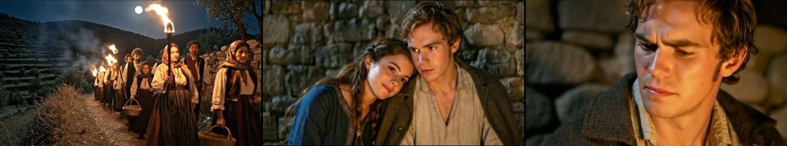
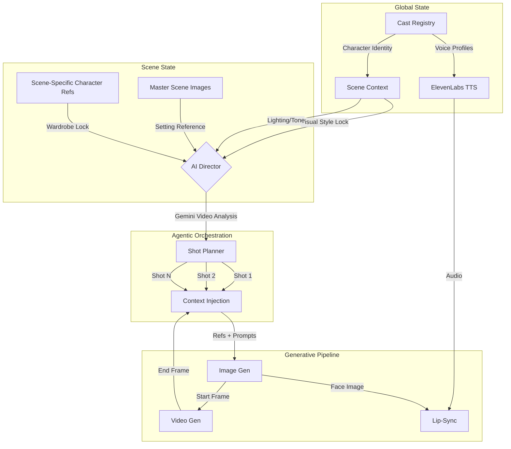
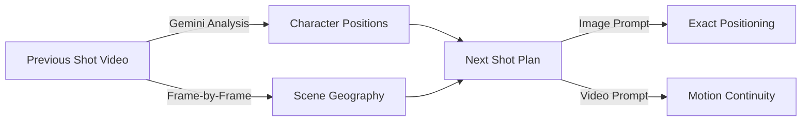

# OpenFilm AI

<div align="center">

### Agentic Shot Orchestration for AI Filmmaking

*A state-management engine for video generation that treats film production as a graph of inherited context, not a single prompt.*

[](https://www.python.org/downloads/)
[](https://reactjs.org/)
[](https://www.electronjs.org/)

</div>

---



> **24 shots. Zero identity drift.** Wide, medium, close-up—all AI-generated with consistent characters across lighting setups and camera angles.

---

## Demo

https://github.com/skolmuirgheasa/openfilmai/raw/main/readme-media/demo_consistency_workflow.mp4

*Generated as a graph of discrete shots with inherited state—not a single long-context prompt. Character identity remains stable across lighting setups, camera angles, and scene transitions.*

---

## The Problem OpenFilm Solves

The generative video industry (Google Veo, OpenAI Sora, Runway) optimizes for **Long Context Tuning (LCT)**—expanding context windows to generate 60+ seconds in a single pass. This approach has fundamental problems:

| Issue | Description |
|-------|-------------|
| **Latent Drift** | Character faces "melt" as the latent representation degrades over time |
| **Editorial Rigidity** | Can't edit pacing without regenerating the entire sequence |
| **Compute Inefficiency** | Exponentially more resources for longer sequences |

### The OpenFilm Solution: Hierarchical State Injection

| LCT Approach | OpenFilm Approach |
|--------------|-------------------|
| Expand context window | Inject state per-shot |
| Fight latent drift | Eliminate it structurally |
| Generate entire scenes | Generate optimal 4-8s clips |
| Pixels remember pixels | State objects remember state |

**How it works:**

1. **State Management** — The "Scene" is a state object holding immutable variables (lighting, character refs, visual style)
2. **Short-Shot Inference** — Generate 4-8s clips where diffusion models perform best
3. **Inheritance** — Each shot inherits the *State* of the scene, not just the pixels of the previous frame

**Result**: Infinite runtime with zero identity drift.

---

## Platform Walkthrough

### Scene State Configuration

Lock lighting, color palette, and atmosphere before generation. All shots inherit this state.


### Hierarchical Character Casting

Define **Global Identity** (face), map to **Scene Appearance** (wardrobe). The system injects the correct combination into every prompt.


### Agentic Shot Planning

The AI Cinematographer (Claude or GPT-4) generates coverage plans based on film theory—Wide, Over-the-Shoulder, Close-up.


### Context-Aware Continuity

Gemini 2.0 Flash analyzes the previous shot's video to extract character positions and lighting for the next shot.


### Timeline Management

The interface functions as a node-based editor. Each shot card holds its prompt, audio, and video assets.


---

## Architecture



### Progressive Shot Chain

```
Shot 1 (Wide)     Shot 2 (Medium)    Shot 3 (Close-up)
    │                  │                   │
    ▼                  ▼                   ▼
┌─────────┐      ┌─────────┐        ┌─────────┐
│ Generate│      │ Generate│        │ Generate│
│  Image  │      │  Image  │        │  Image  │
└────┬────┘      └────┬────┘        └────┬────┘
     │                │                   │
     ▼                ▼                   ▼
┌─────────┐      ┌─────────┐        ┌─────────┐
│ Generate│──────│ Generate│────────│ Generate│
│  Video  │ end  │  Video  │  end   │  Video  │
└─────────┘frame └─────────┘ frame  └─────────┘
              ▲                  ▲
              │                  │
         Start Frame        Start Frame
         Continuity         Continuity
```

The **last frame of Shot N becomes the start frame for Shot N+1**, creating seamless visual continuity.

---

## Quick Start

### Prerequisites

- Node.js 18+
- Python 3.9+
- ffmpeg (with ffprobe)

### Installation

```bash
# Clone
git clone https://github.com/skolmuirgheasa/openfilmai.git
cd openfilmai

# Frontend dependencies
npm install

# Python environment
python3 -m venv .venv
source .venv/bin/activate  # Windows: .venv\Scripts\activate
pip install -r requirements.txt

# Run (starts backend + frontend + Electron)
npm run dev
```

### API Keys Required

Configure in Settings (gear icon):

| Service | Purpose | Required |
|---------|---------|----------|
| **Replicate** | Image/video generation (NanoBanana, Kling, Seedance) | Yes |
| **Anthropic** or **OpenAI** | Shot planning, scene analysis | Yes |
| **ElevenLabs** | Text-to-speech, voice cloning | For audio |
| **WaveSpeed** | Lip-sync animation | For talking heads |
| **Google Vertex AI** | Veo 3.1, Gemini 2.0 Flash | For AI Director |

---

## Stack & Integrations

| Modality | Provider | Purpose |
|----------|----------|---------|
| **Video Generation** | [Google Vertex AI](https://cloud.google.com/vertex-ai) (Veo 3.1) | Video synthesis |
| | [Replicate](https://replicate.com) (Kling, Seedance) | Alternative video models |
| **Image Generation** | [Replicate](https://replicate.com) (NanoBanana, Seedream, Flux) | Multi-reference image synthesis (up to 14 refs) |
| **Orchestration** | [Anthropic](https://anthropic.com) (Claude) | Shot planning, scene analysis |
| | [OpenAI](https://openai.com) (GPT-4) | Alternative LLM orchestration |
| **Vision Analysis** | [Google Gemini](https://deepmind.google/technologies/gemini/) 2.0 Flash | AI Director—video continuity analysis |
| **Voice/TTS** | [ElevenLabs](https://elevenlabs.io) | Character voices, voice cloning |
| **Lip-Sync** | [WaveSpeed AI](https://wavespeed.ai) (InfiniteTalk) | Audio-driven facial animation |

---

## Key Capabilities

### Hierarchical State Injection

Every shot inherits from parent state objects:

```typescript
interface ShotState {
  // Scene-level state (immutable per scene)
  scene_master_images: string[];     // Setting/location lock
  scene_character_refs: string[];    // Wardrobe/appearance lock
  visual_style: string;              // Color palette, camera style

  // Shot-level continuity
  previous_shot_end_frame: string;   // Frame chain anchor
  previous_shot_id: string;          // Graph linkage

  // Character-level identity (fallback hierarchy)
  global_character_refs: string[];   // Identity baseline
  voice_id: string;                  // ElevenLabs voice profile
}
```

### AI Director: Video-Aware Planning



Send multiple prior shots to Gemini for narrative understanding—the AI sees visual flow, not just text.

### Audio-Driven Animation

```
Text ──► ElevenLabs TTS ──► Audio Track
                               │
Character Ref Image ───────────┼──► WaveSpeed Lip-Sync ──► Talking Video
                               │
Scene Context ─────────────────┘
```

---

## Data Model

### Scene State

```python
class Scene:
    scene_id: str
    title: str
    description: str

    # Visual State Lock
    master_image_ids: List[str]
    visual_style: str
    color_palette: str
    camera_style: str

    # Character State
    cast: List[SceneCast]

    # Shot Graph
    shots: List[Shot]
```

### Shot (Generation Unit)

```python
class Shot:
    shot_id: str
    shot_number: int

    # Planning
    camera_angle: str
    subject: str
    action: str
    characters_in_shot: List[str]
    dialogue: Optional[str]
    prompt: str

    # Continuity (the key to zero drift)
    start_frame_path: Optional[str]  # Previous shot's end frame
    scene_id: str                    # Links to parent Scene

    # Outputs
    image_path: Optional[str]
    audio_path: Optional[str]
    file_path: Optional[str]
    status: Literal["planned", "image_ready", "audio_ready", "video_ready"]
```

---

## Project Structure

```
openfilmai/
├── frontend/                    # React + TypeScript UI
│   └── src/App.tsx             # Main application
├── backend/
│   ├── main.py                 # FastAPI server, all endpoints
│   ├── ai/
│   │   ├── cinematographer.py  # Shot planning prompts
│   │   ├── vertex_client.py    # Veo 3.1 + Gemini AI Director
│   │   └── replicate_client.py # NanoBanana, Kling, Seedance
│   ├── video/
│   │   └── ffmpeg.py           # Frame extraction, optical flow
│   └── storage/
│       └── files.py            # Metadata persistence
├── project_data/               # User projects (created at runtime)
├── electron.js                 # Desktop shell
└── requirements.txt
```

---

## Environment Variables

```bash
# API Keys (or configure in Settings UI)
export REPLICATE_API_TOKEN="r8_..."
export ANTHROPIC_API_KEY="sk-ant-..."
export OPENAI_API_KEY="sk-..."
export ELEVENLABS_API_KEY="..."
export WAVESPEED_API_KEY="..."

# Google Cloud (for Vertex AI / Veo 3.1)
export GOOGLE_APPLICATION_CREDENTIALS="/path/to/service-account.json"
export GOOGLE_CLOUD_PROJECT="your-project-id"
export VERTEX_LOCATION="us-central1"
export VERTEX_TEMP_BUCKET="your-gcs-bucket"
```

---

## Roadmap

- [ ] Batch generation — Queue multiple shots for overnight rendering
- [ ] Version control — Track shot iterations, revert to previous takes
- [ ] Multi-scene projects — Scene graph with cross-scene character consistency
- [ ] Export presets — Direct export to Premiere XML, DaVinci

---

## Contributing

Contributions welcome.

1. Fork the repository
2. Create a feature branch
3. Submit a pull request

---

## License

MIT

---

<div align="center">

**OpenFilm AI** — State injection for AI filmmaking. Zero drift. Infinite runtime.

</div>
