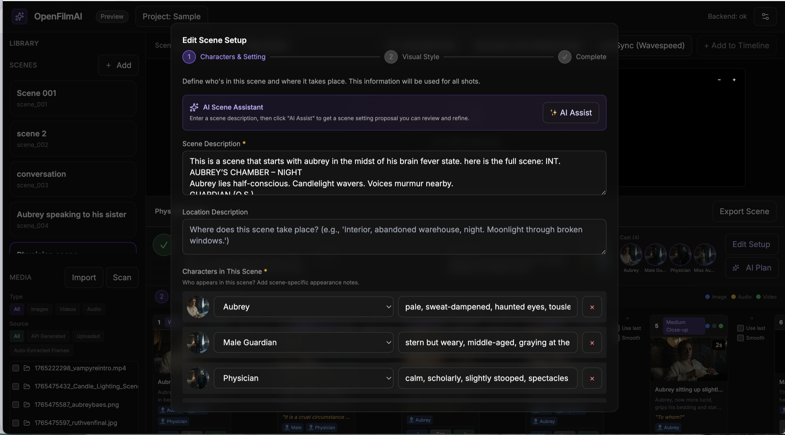
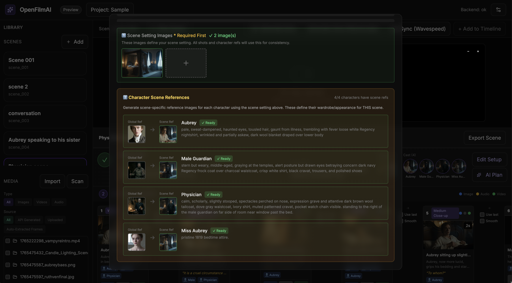
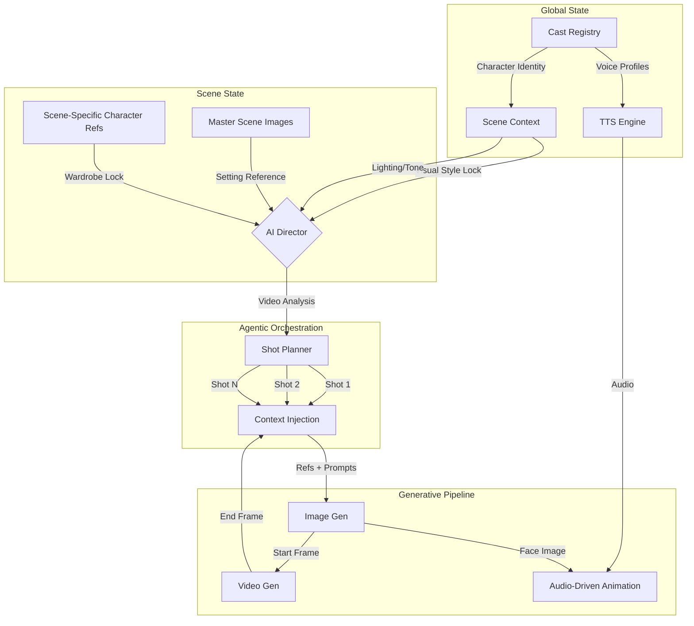
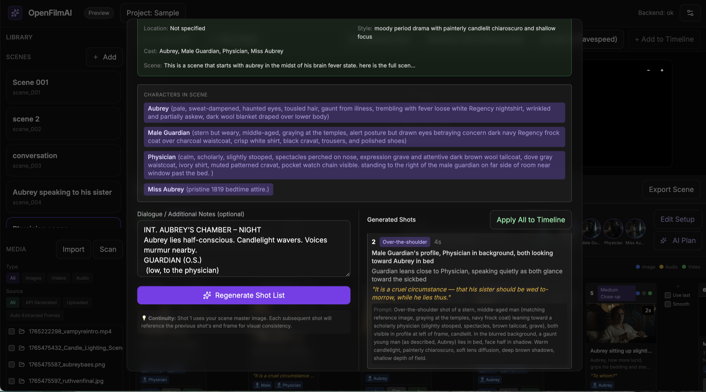
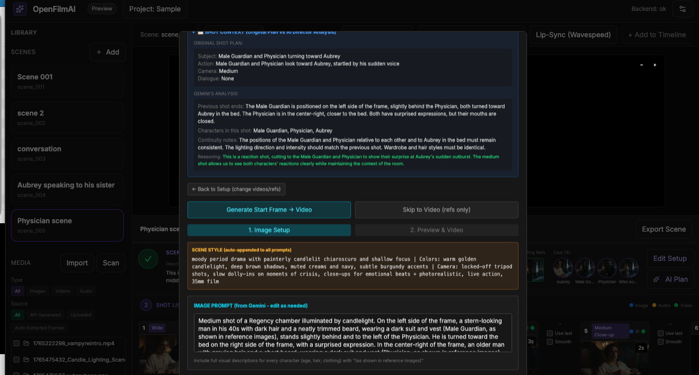
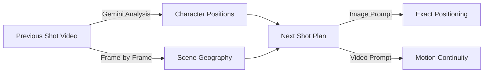

# OpenFilm AI

<div align="center">

### Agentic Shot Orchestration for AI Filmmaking

A state-management engine for video generation that treats film production as a graph of inherited context, not a single prompt.

[](https://www.python.org/downloads/)
[](https://reactjs.org/)
[](https://www.electronjs.org/)

</div>

---

<p align="center">



</p>

**Scene state configuration** | **Hierarchical character casting** | **Shot graph timeline**

---

## Demo

<p align="center">
<video src="https://github.com/user-attachments/assets/e5fe4140-4180-4440-a33c-5031f991e967" width="480" controls></video>
</p>

**12 shots | 01:54 runtime | Consistent characters, setting, voices**

---

## The Architectural Divergence

The current generative video industry (Veo, Runway, Kling) is optimizing for **Temporal Coherence via Long Context Tuning (LCT)**. Their goal: expand the model's context window to generate 60+ seconds of continuous video in a single inference pass.

### The Problems with LCT

| Issue | Description |
|-------|-------------|
| **Latent Drift** | As the context window expands, character identity features degrade ("melting faces"). The latent representation loses fidelity over time. |
| **Editorial Rigidity** | A 60-second generation cannot be easily edited or paced without regenerating the entire context. |
| **Compute Inefficiency** | Generating a 2-minute scene as a single context window requires exponentially more compute than generating twenty 6-second clips. |

Current state of the art: Veo 3.1 generates 8-second clips. Runway and Kling produce similar durations. None offer native long-form generation without multi-clip workarounds.

### The OpenFilm Solution: Hierarchical State Injection

Instead of Long Context Tuning, OpenFilm uses a fundamentally different architecture:

| LCT Approach | OpenFilm Approach |
|--------------|-------------------|
| Expand context window | Inject state per-shot |
| Fight latent drift | Eliminate it structurally |
| Generate entire scenes | Generate optimal 4-8s clips |
| Pixels remember pixels | State objects remember state |

**How it works:**

1. **State Management**: The "Scene" is a state object holding immutable variables (lighting, character appearance refs, visual style tokens)
2. **Short-Shot Inference**: Generate standard 4-8s clips where diffusion models perform best
3. **Inheritance**: Each new shot inherits the *State* of the scene, not just the pixels of the previous frame

**Result**: Infinite total runtime with zero identity drift, matching the actual workflow of professional nonlinear editing (NLE).

---

## Architecture



### The Production Pipeline

OpenFilm decomposes filmmaking into the same workflow human filmmakers use:

1. **Lock the look**: Establish visual style, lighting, and character appearances at the scene level (State Lock)
2. **Plan the coverage**: AI cinematographer generates shot list with camera angles, subjects, actions
3. **Shoot progressively**: Each shot inherits scene state + previous shot's end frame
4. **Maintain continuity**: End frame of Shot N becomes start frame for Shot N+1 (Frame Chain)

This is not a prompt template. It is a **state propagation engine** that ensures every AI call receives exactly the visual context needed for consistency, without expanding context windows or fighting latent drift.

---

## Platform Walkthrough

### Scene State Configuration

Define lighting, color palette, and atmosphere variables before generation. All shot nodes inherit this state object.


### Hierarchical Character Casting

Map **Global Identity** (face) to **Scene Appearance** (wardrobe). The system injects the specific reference combination into every prompt automatically.


### Agentic Shot Planning

The AI Director parses screenplay text and generates a coverage plan (Wide, OTS, Close-up) based on standard cinematic theory.



### Context-Aware Continuity

The AI Director watches your previous shot's video using Gemini 2.0 Flash and plans the next shot with full visual understanding. It calculates character positioning and lighting vectors to enforce continuity.



---

## Key Capabilities

### Hierarchical State Injection

Every shot automatically inherits from its parent state objects:

```typescript
interface ShotState {
  // Scene-level state (immutable per scene)
  scene_master_images: string[];     // Setting/location lock - prevents environment drift
  scene_character_refs: string[];    // Wardrobe/appearance lock - prevents costume drift
  visual_style: string;              // Color palette, camera style - prevents tone drift

  // Shot-level continuity (the key to consistency)
  previous_shot_end_frame: string;   // Frame chain anchor - eliminates cut discontinuity
  previous_shot_id: string;          // Graph linkage - enables state traversal

  // Character-level identity (fallback hierarchy)
  global_character_refs: string[];   // Identity baseline when no scene-specific ref exists
  voice_id: string;                  // Voice profile for TTS
}
```

The system resolves inheritance at generation time. Define refs once, and they propagate automatically.

### AI Director: Video-Aware Shot Planning



**Multi-video context**: Send multiple prior shots to Gemini for narrative understanding. The AI sees the scene's visual flow, not just text descriptions.

### Progressive Shot Chain

```
Shot 1 (Wide)     Shot 2 (Medium)    Shot 3 (Close-up)
    │                  │                   │
    ▼                  ▼                   ▼
┌─────────┐      ┌─────────┐        ┌─────────┐
│ Generate│      │ Generate│        │ Generate│
│  Image  │      │  Image  │        │  Image  │
└────┬────┘      └────┬────┘        └────┬────┘
     │                │                   │
     ▼                ▼                   ▼
┌─────────┐      ┌─────────┐        ┌─────────┐
│ Generate│──────│ Generate│────────│ Generate│
│  Video  │ end  │  Video  │  end   │  Video  │
└─────────┘frame └─────────┘ frame  └─────────┘
              ▲                  ▲
              │                  │
         Start Frame        Start Frame
         Continuity         Continuity
```

Each video generation uses the **last frame of the previous shot as its start frame**, creating seamless visual continuity without manual frame extraction.

### Audio-Driven Animation Pipeline

```
Text ──► TTS ──► Audio Track
                     │
Character Image ─────┼──► WaveSpeed ──► Animated Video
                     │
Scene Context ───────┘
```

Generate dialogue audio, then animate character reference images with synchronized lip movement.

---

## Supported Generation Models

| Type | Models | Provider |
|------|--------|----------|
| **Image** | NanoBanana (14-image reference), Seedream, Flux | Replicate |
| **Video** | Veo 3.1, Kling 2.5, Seedance | Vertex AI, Replicate |
| **Voice** | 29+ voices, voice cloning | ElevenLabs |
| **Animation** | InfiniteTalk | WaveSpeed |

---

## Data Model

### Scene State

```python
class Scene:
    scene_id: str
    title: str
    description: str

    # Visual State Lock
    master_image_ids: List[str]
    visual_style: str
    color_palette: str
    camera_style: str

    # Character State
    cast: List[SceneCast]

    # Shot Graph
    shots: List[Shot]
```

### Shot (Generation Unit)

```python
class Shot:
    shot_id: str
    shot_number: int

    # Planning
    camera_angle: str
    subject: str
    action: str
    characters_in_shot: List[str]
    dialogue: Optional[str]
    prompt: str

    # Continuity (the key to zero drift)
    start_frame_path: Optional[str]  # Previous shot's end frame
    scene_id: str                    # Links to parent Scene

    # Outputs
    image_path: Optional[str]
    audio_path: Optional[str]
    file_path: Optional[str]
    status: Literal["planned", "image_ready", "audio_ready", "video_ready"]
```

---

## Quick Start

### Prerequisites

- Node.js 18+
- Python 3.9+
- ffmpeg (with ffprobe)

### Installation

```bash
git clone https://github.com/skolmuirgheasa/openfilmai.git
cd openfilmai

npm install

python3 -m venv .venv
source .venv/bin/activate  # Windows: .venv\Scripts\activate
pip install -r requirements.txt

npm run dev
```

### API Keys Required

Configure in Settings:

| Service | Purpose | Required |
|---------|---------|----------|
| **Replicate** | Image/video generation | Yes |
| **Anthropic** or **OpenAI** | Shot planning, scene analysis | Yes |
| **ElevenLabs** | Text-to-speech, voice cloning | For audio |
| **WaveSpeed** | Audio-driven animation | For dialogue |
| **Google Cloud** | Veo 3.1, Gemini | For AI Director |

---

## Project Structure

```
openfilmai/
├── frontend/                    # React + TypeScript UI
│   └── src/App.tsx             # Main application
├── backend/
│   ├── main.py                 # FastAPI server
│   ├── ai/
│   │   ├── cinematographer.py  # Shot planning
│   │   ├── vertex_client.py    # Google AI integration
│   │   └── replicate_client.py # Replicate integration
│   ├── video/
│   │   └── ffmpeg.py           # Frame extraction
│   └── storage/
│       └── files.py            # Metadata persistence
├── project_data/               # User projects (runtime)
├── electron.js                 # Desktop shell
└── requirements.txt
```

---

## Environment Variables

```bash
export REPLICATE_API_TOKEN="..."
export ANTHROPIC_API_KEY="..."
export OPENAI_API_KEY="..."
export ELEVENLABS_API_KEY="..."
export WAVESPEED_API_KEY="..."

# Google Cloud (for Vertex AI)
export GOOGLE_APPLICATION_CREDENTIALS="/path/to/service-account.json"
export GOOGLE_CLOUD_PROJECT="your-project-id"
export VERTEX_LOCATION="us-central1"
```

---

## Roadmap

- [ ] Batch generation: Queue multiple shots for overnight rendering
- [ ] Version control: Track shot iterations, revert to previous takes
- [ ] Multi-scene projects: Scene graph with cross-scene character consistency
- [ ] Export presets: Direct export to Premiere XML, DaVinci

---

## Contributing

Contributions welcome.

1. Fork the repository
2. Create a feature branch
3. Submit a pull request

---

## License

MIT

---

<div align="center">

**OpenFilm AI**: State injection for AI filmmaking. Zero drift. Infinite runtime.

</div>
