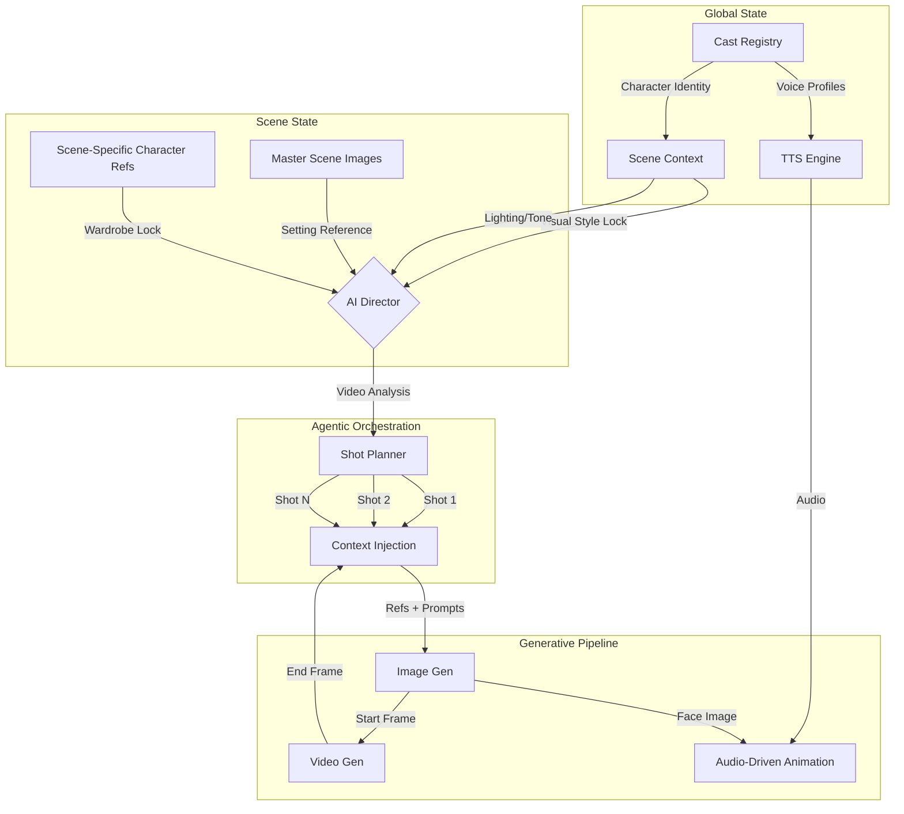
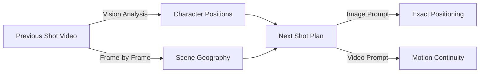

# OpenFilm AI

<div align="center">

### Agentic Shot Orchestration for AI Filmmaking

A state-management engine for video generation. Treats film production as a graph of inherited context rather than a single continuous prompt.

[](https://www.python.org/downloads/)
[](https://reactjs.org/)
[](https://www.electronjs.org/)

</div>

---

<p align="center">


</p>

**Scene setup** | **Character casting** | **Shot timeline**

Define visual state, map characters to appearances, manage the shot graph.

---

## Demo

<a href="https://github.com/user-attachments/assets/e5fe4140-4180-4440-a33c-5031f991e967">

</a>

12 shots | 01:54 runtime | Consistent characters, setting, voices

---

## The Problem

Current video generation models optimize for Long Context Tuning. They expand context windows to generate longer clips in a single inference pass. Veo 3.1 generates 8-second clips. Runway generates similar durations. None offer native long-form generation without multi-clip workarounds.

**Technical constraints of this approach:**

| Issue | Description |
|-------|-------------|
| **Latent Drift** | Character identity features degrade as the latent representation expands over time |
| **Editorial Rigidity** | Pacing edits require regenerating the full context window |
| **Compute Inefficiency** | Generating a 2-minute scene as a single context requires exponentially more compute than chaining twenty 6-second clips |

### The OpenFilm Solution: Hierarchical State Injection

This architecture replaces long-context generation with graph-based state management.

| Long Context Approach | OpenFilm Approach |
|----------------------|-------------------|
| Single context window | Graph of discrete nodes |
| Temporal attention | State inheritance |
| One-shot generation | Recursive generation |
| Pixels remember pixels | State objects remember state |

**Mechanism:**

1. **State Management:** The Scene object holds immutable variables (lighting, character refs, visual style)
2. **Short-Shot Inference:** Generate 4-8s clips where diffusion models perform best
3. **Inheritance:** New shots inherit the state of the scene and the end-frame of the previous shot

**Result:** Infinite total runtime with zero identity drift.

---

## Platform Walkthrough

### Scene State Configuration

Users define lighting, color palette, and atmosphere variables before generation. All shot nodes inherit this state object.


### Hierarchical Character Casting

The system maps Global Identity (face) to Scene Appearance (wardrobe). It injects the specific reference combination into every prompt.


### Agentic Shot Planning

The AI Director parses screenplay text and generates a coverage plan (Wide, OTS, Close-up) based on standard cinematic theory.


### Context-Aware Continuity

The system analyzes the video file of Shot N-1, calculates character positioning and lighting vectors, and enforces continuity in Shot N.


---

## Architecture



### Progressive Shot Chain

```
Shot 1 (Wide)     Shot 2 (Medium)    Shot 3 (Close-up)
    │                  │                   │
    ▼                  ▼                   ▼
┌─────────┐      ┌─────────┐        ┌─────────┐
│ Generate│      │ Generate│        │ Generate│
│  Image  │      │  Image  │        │  Image  │
└────┬────┘      └────┬────┘        └────┬────┘
     │                │                   │
     ▼                ▼                   ▼
┌─────────┐      ┌─────────┐        ┌─────────┐
│ Generate│──────│ Generate│────────│ Generate│
│  Video  │ end  │  Video  │  end   │  Video  │
└─────────┘frame └─────────┘ frame  └─────────┘
              ▲                  ▲
              │                  │
         Start Frame        Start Frame
         Continuity         Continuity
```

The last frame of Shot N becomes the start frame for Shot N+1. This creates seamless visual continuity.

---

## Quick Start

### Prerequisites

- Node.js 18+
- Python 3.9+
- ffmpeg (with ffprobe)

### Installation

```bash
git clone https://github.com/skolmuirgheasa/openfilmai.git
cd openfilmai

npm install

python3 -m venv .venv
source .venv/bin/activate  # Windows: .venv\Scripts\activate
pip install -r requirements.txt

npm run dev
```

### API Keys Required

Configure in Settings:

| Service | Purpose | Required |
|---------|---------|----------|
| **Replicate** | Image/video generation | Yes |
| **Anthropic** or **OpenAI** | Shot planning, scene analysis | Yes |
| **ElevenLabs** | Text-to-speech, voice cloning | For audio |
| **WaveSpeed** | Audio-driven animation | For dialogue |
| **Google Cloud** | Veo 3.1, Gemini | For AI Director |

---

## Stack & Integrations

| Modality | Provider | Purpose |
|----------|----------|---------|
| **Video Generation** | [Google Vertex AI](https://cloud.google.com/vertex-ai), [Replicate](https://replicate.com) | Video synthesis |
| **Image Generation** | [Replicate](https://replicate.com) | Multi-reference image synthesis |
| **Orchestration** | [Anthropic](https://anthropic.com), [OpenAI](https://openai.com) | Shot planning, scene analysis |
| **Vision Analysis** | [Google Gemini](https://deepmind.google/technologies/gemini/) | Video continuity analysis |
| **Voice/TTS** | [ElevenLabs](https://elevenlabs.io) | Character voices |
| **Animation** | [WaveSpeed AI](https://wavespeed.ai) | Audio-driven facial animation |

---

## Key Capabilities

### Hierarchical State Injection

Every shot inherits from parent state objects:

```typescript
interface ShotState {
  // Scene-level state (immutable per scene)
  scene_master_images: string[];     // Setting/location lock
  scene_character_refs: string[];    // Wardrobe/appearance lock
  visual_style: string;              // Color palette, camera style

  // Shot-level continuity
  previous_shot_end_frame: string;   // Frame chain anchor
  previous_shot_id: string;          // Graph linkage

  // Character-level identity (fallback hierarchy)
  global_character_refs: string[];   // Identity baseline
  voice_id: string;                  // Voice profile
}
```

### AI Director: Video-Aware Planning



The system sends multiple prior shots for narrative understanding. The AI sees visual flow, not just text.

### Audio-Driven Animation

```
Text ──► TTS ──► Audio Track
                     │
Character Image ─────┼──► WaveSpeed ──► Animated Video
                     │
Scene Context ───────┘
```

---

## Data Model

### Scene State

```python
class Scene:
    scene_id: str
    title: str
    description: str

    # Visual State Lock
    master_image_ids: List[str]
    visual_style: str
    color_palette: str
    camera_style: str

    # Character State
    cast: List[SceneCast]

    # Shot Graph
    shots: List[Shot]
```

### Shot (Generation Unit)

```python
class Shot:
    shot_id: str
    shot_number: int

    # Planning
    camera_angle: str
    subject: str
    action: str
    characters_in_shot: List[str]
    dialogue: Optional[str]
    prompt: str

    # Continuity (the key to zero drift)
    start_frame_path: Optional[str]  # Previous shot's end frame
    scene_id: str                    # Links to parent Scene

    # Outputs
    image_path: Optional[str]
    audio_path: Optional[str]
    file_path: Optional[str]
    status: Literal["planned", "image_ready", "audio_ready", "video_ready"]
```

---

## Project Structure

```
openfilmai/
├── frontend/                    # React + TypeScript UI
│   └── src/App.tsx             # Main application
├── backend/
│   ├── main.py                 # FastAPI server
│   ├── ai/
│   │   ├── cinematographer.py  # Shot planning
│   │   ├── vertex_client.py    # Google AI integration
│   │   └── replicate_client.py # Replicate integration
│   ├── video/
│   │   └── ffmpeg.py           # Frame extraction
│   └── storage/
│       └── files.py            # Metadata persistence
├── project_data/               # User projects (runtime)
├── electron.js                 # Desktop shell
└── requirements.txt
```

---

## Environment Variables

```bash
export REPLICATE_API_TOKEN="..."
export ANTHROPIC_API_KEY="..."
export OPENAI_API_KEY="..."
export ELEVENLABS_API_KEY="..."
export WAVESPEED_API_KEY="..."

# Google Cloud (for Vertex AI)
export GOOGLE_APPLICATION_CREDENTIALS="/path/to/service-account.json"
export GOOGLE_CLOUD_PROJECT="your-project-id"
export VERTEX_LOCATION="us-central1"
```

---

## Roadmap

- [ ] Batch generation: Queue multiple shots for overnight rendering
- [ ] Version control: Track shot iterations, revert to previous takes
- [ ] Multi-scene projects: Scene graph with cross-scene character consistency
- [ ] Export presets: Direct export to Premiere XML, DaVinci

---

## Contributing

Contributions welcome.

1. Fork the repository
2. Create a feature branch
3. Submit a pull request

---

## License

MIT

---

<div align="center">

**OpenFilm AI**: State injection for AI filmmaking. Zero drift. Infinite runtime.

</div>
